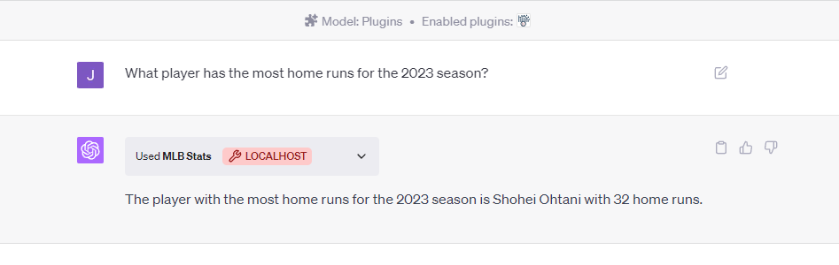

# MLB Stats ChatGPT Plugin

This package serves ChatGPT with up-to-date baseball news and statistics from popular data stores like Baseball Reference, Baseball Savant, and FanGraphs.  

### What are ChatGPT Plugins?

Plugins are tools designed specifically for language models with safety as a core principle, and help ChatGPT access up-to-date information, run computations, or use third-party services.

[https://openai.com/blog/chatgpt-plugins](https://openai.com/blog/chatgpt-plugins)

### Installation

Currently, you must be a [ChatGPT Plus](https://openai.com/blog/chatgpt-plus) user to use plugins.

If you are a ChatGPT Plus user:

[Insert how to install the plugin]

### Usage

`What player has the most home runs for the 2023 season?`

`Summarize Austin Hay's batting performance for the 2023 season`

### Advanced Usage [Work in Progress]

`Assume the Yankees are playing the Orioles tomorrow. Create an algorithm that can predict how many runs will be scored by each team. Use the MLB Stats plugin to retrieve the data for these calculations and output the result.`

A good proof-of-concept for potential capabilities, but the model is slightly off on its numbers retrieved from the plugin. Since we can see the numbers retrieved from the plugin (click the down arrow on “Used MLB Stats plugin”), we can give it the accurate numbers.

`The Yankees have only scored 400 runs.`

`They've also only allowed 380 runs`

Not ideal that we have to correct it, but things will be improved with time. 

### Limitations

There is a limit to how much data that can be given to ChatGPT that is quantified by [tokens](https://help.openai.com/en/articles/4936856-what-are-tokens-and-how-to-count-them). This blocks potential queries that aggregate a large amount of data e.g. “`Summarize the batting statcast data for Adley Rustchman over the past month`”. Some functions of the plugin have been adjusted to account for these rate limits by segmenting the requests, but some errors still may be encountered. 

### Disclaimer

******************This project and OpenAI’s ChatGPT are under active development and testing. As stated by OpenAI, “ChatGPT may produce inaccurate information about people, places, or facts.” The same applies the model’s interpretation of some baseball statistics and information.****************** 

### Getting inaccurate results or errors?

Submit your query and the response as an [issue](https://github.com/fogel-j/baseball-stats-ai/issues). 

### Credit

This project exists mostly as an API between [pybaseball](https://github.com/jldbc/pybaseball) and ChatGPT, so credit goes to each of these groups for making this plugin possible. I only hope to bridge the two.